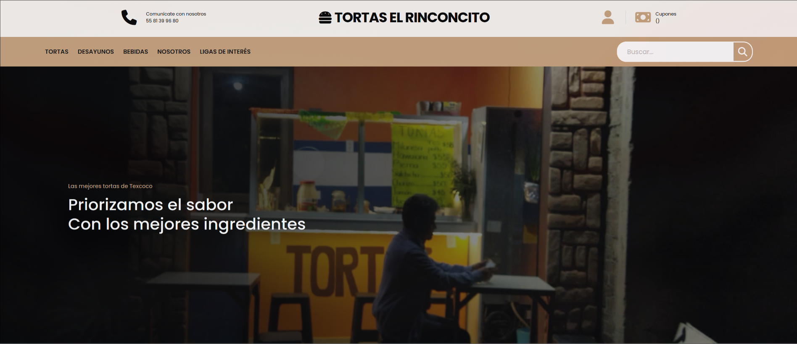
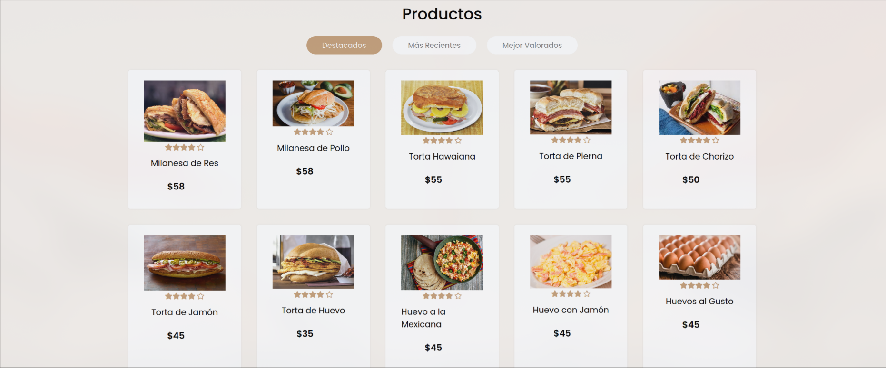
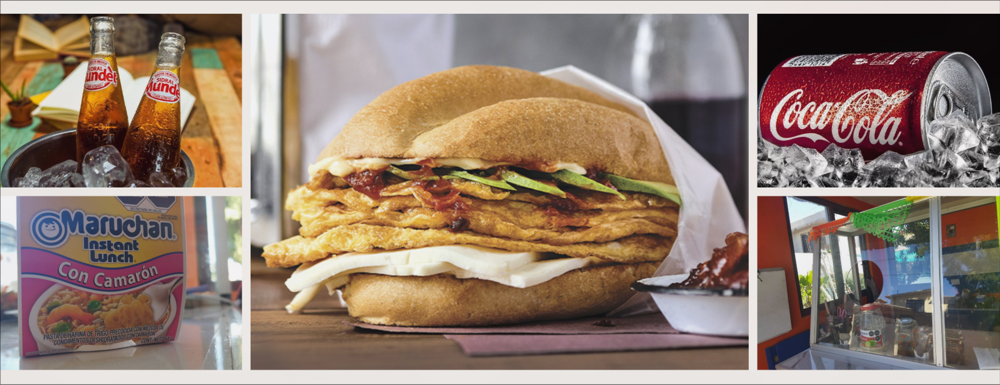
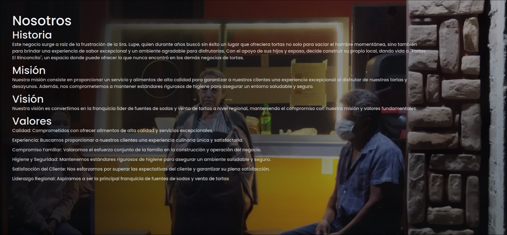
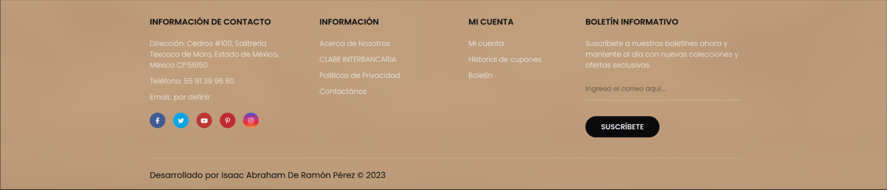
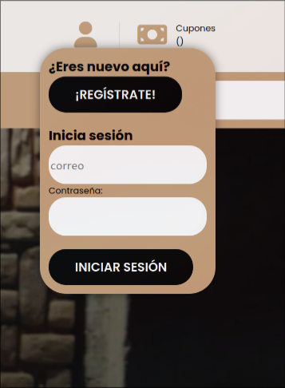
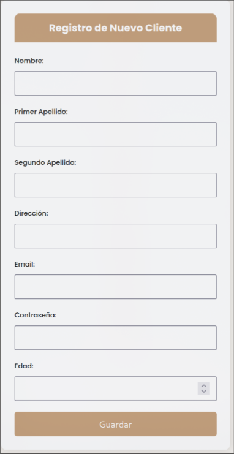
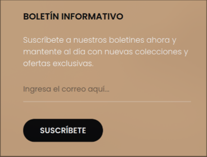
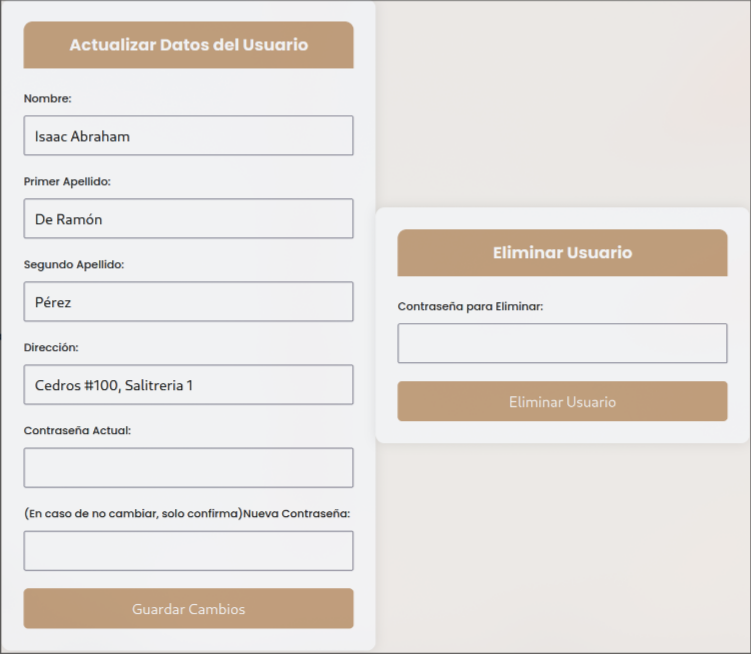
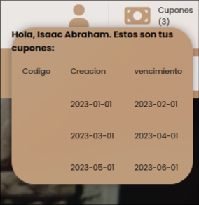

# Proyecto de programación web

## Repositorio oficial de la página de TORTAS "EL RINCONCITO¨

Proyecto hecho para programacion web 1 del grupo 1510 con el profesor Aaron Velasco Agustín de la FES ARAGÓN, UNAM.
Por ISAAC ABRAHAM DE RAMÓN PÉREZ

La idea de hacer la pagina web centrada en el negocio de tortas "el rinconcito" nacio de la ya existente necesidad de crear una pagina web para dar a conocer el negocio familiar.

Para hacer el diseño de la pagina web, se utilizo la plantilla del canal de You-Tube: Programación para el Mundo.
https://www.youtube.com/@programacionparaelmundo

del video:

https://www.youtube.com/watch?v=L3tal8ATx5o&ab_channel=Programaci%C3%B3nparaelMundo

## Capturas de Pantalla
Aqui podemos ver el header, con el navbar y despues el navbar con un slogan simple

Tenemos varias caracteristicas y categorias en forma de tarjeta para hacerlo mas ameno a la vista, destacando que al dar clic en "ver más" despliega unicamente la categoria deseada con un refresh de pagina.

En scripts de php se hace la consulta sql tomando como variable la categoria que se seleccionó y se imprimen los elementos de la misma como tarjetas.

Galería simple de fotos del negocio y otros productos como refrescos y comidas.

Un banner más grande y la descripcion breve de nuestra organización.

Aqui se liga este repositorio tanto la pagina principal como solo el readme que estás leyendo.

Informacion ya no tan relevante, la cual decidi no darle tanto cuidado. Esto a excepcion del input del correo que se comentará a fondo más adelante.

## Características Principales

- El despliegue de los productos se hace directamente de la base de datos a traves de php.

- La pagina cuenta con un sistema de usuarios con login y modificacion del perfil, todo esto conectado a la base de datos ademas de una tabla dedicada a correos para recibir notificaciones del negocio.

- tambien se puede modificar el usuario.

- Contamos con un sistema simple de cupones los cuales puedes ver desplegados en el simbolo de billete

## Tecnologías Utilizadas

Para este proyecto se utilizaron todas estas tecnologías

- HTML
    - Es la estructura del marcado de todo el texto.
- CSS
    - Estilos, la segunda parte mas extensa en codigo del proyecto.
- JavaScript
    - Para algunas funciones porque no me convencía su implementacion en php
- PHP
    - Para todo lo que tuviera que ver con consultas a bases de datos y sesiones de usuarios.
- MYSQL
    - Crucial para el funcionamiento de los sistemas de usuario y menú.

Todas estas con la ayuda de las herramientas de XAMPPP.
- Apache
- PhpMyAdmin
    - MariaDB (Durante las pruebas)
    - MySQL (En producción)
